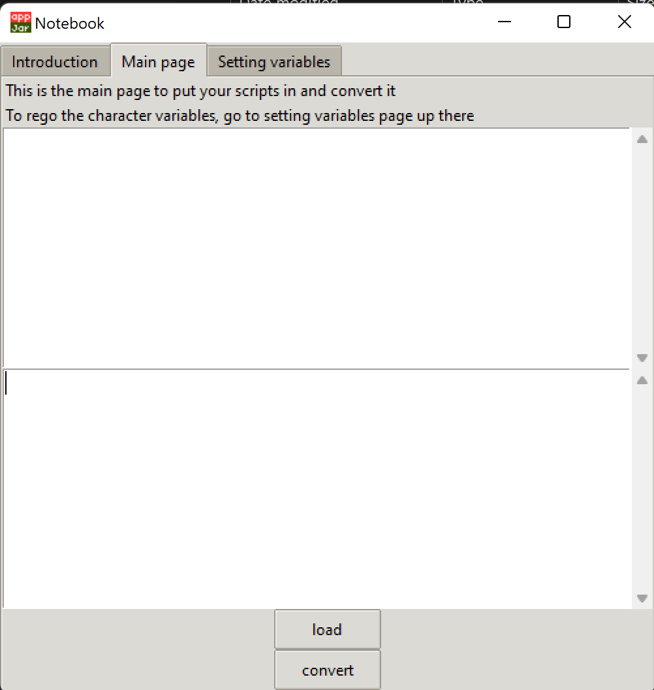
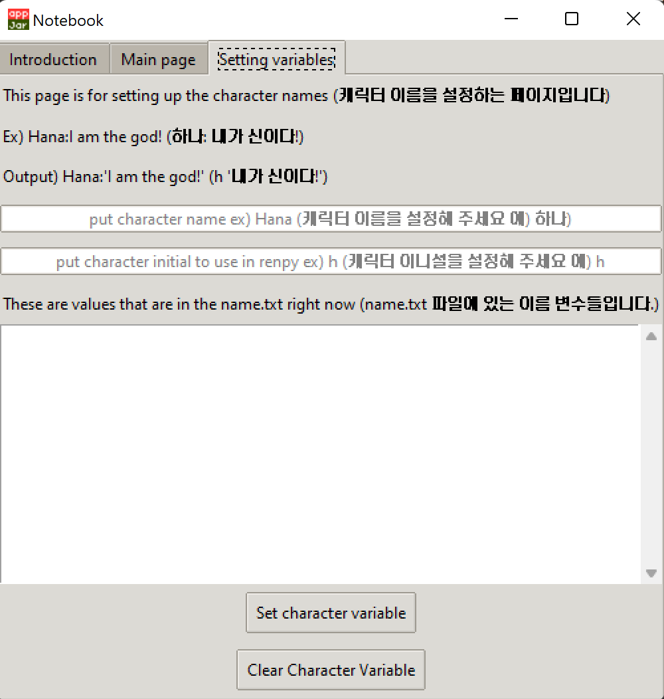
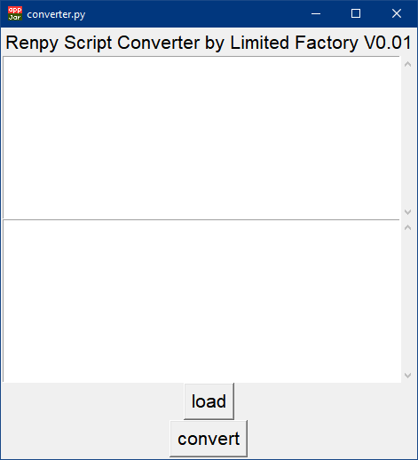

# Renpy Script Converter by KUN
## Version 0.1.1 Update

 

When you paste or select the file by the button, the converter will wrap your sentences into renpy script '' <- this.
Then the file will be saved as output.txt, or you can just view them from the tool as well. 

 {:height="50%" width="50%"}

now, you can also have your char variables to be set as well.
This will set the char variable and convert your written script with it.

** Important **
you need to put your original script into specific way to successfully convert them into a renpy script.
please follow the prompt for more info. 

## Version 0.01 Update

 {:height="50%" width="50%"}
 
 스크립트를 넣고, Load 를 먼저 누르고. Convert 를 눌러주세요.
 
 결과는 out.txt 로 저장됩니다.
 
 ### 쓰는 방법
 
1) 최근 릴리즈된 파일을 다운해 주세요
2) convert.pyw 를 클릭해 주세요 (압축을 푼 이후에)
3) 스크립트를 모두 다 첫 번째 박스에 넣고 Load 를 눌러주세요
4) "loaded" 라는 안내문 이후에 convert 를 눌러주세요
5) ???
6) 존나좋군!
 

# Renpy Script Converter (ENG)
#### LIMITED FACTORY

### Introduction

 

Heya. This is Limited Factory, who is developing a Hana's Campus Life game.
For this project, I developed simple script converter and I would like to share
with everyone.

Just paste the script, click load. This will load the scripts into in.txt 
then click convert, this will convert the lines into renpy scripts.

- Please put all the suggestion into a github :) 

### How to use it

1) Download the release file (the most recent one)
2) click the converter.pyw 
3) paste all the script there and click load. 
4) click convert after the prompt says "loaded"
3) ???
4) PROFIT! 

- it might require you to have python interpreter. 
- If you have renpy downloaded, no need for the python.

 
 
 
 
 
